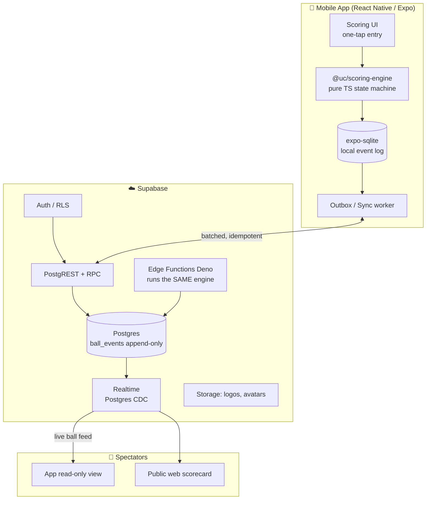
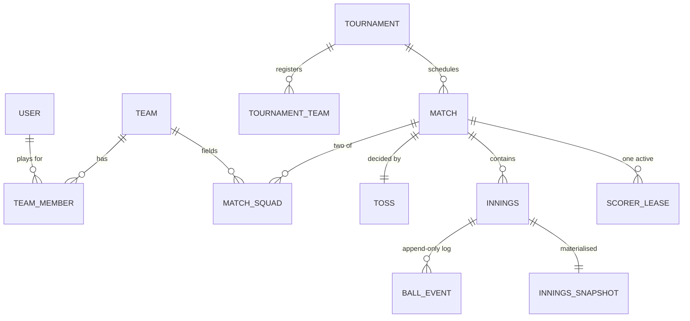
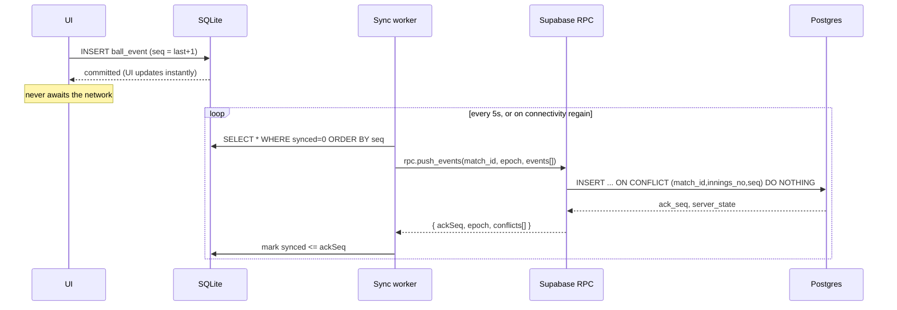

# UltimateCricket — Architecture Plan

**Version:** 0.1 (draft for review)
**Date:** 16 Aug 2026
**Stack decision:** React Native (Expo) + Supabase
**Scope decision:** 3 tournament formats in v1 — Knockout, Round Robin, Groups → Playoffs
**Audience decision:** All ages, kid-friendly UI

---

## 0. The strategic premise (read this before the tech)

CricHeroes is free, has 40M+ users, ~30k matches scored per month, and already does
scoring + tournaments + leagues + streaming. You are not entering an empty market.

Since you've chosen an all-ages product rather than a compliance-gated kids-only one,
you have **no structural moat**. That means the moat has to be execution, and there are
exactly two places execution can win:

1. **It works with no signal.** Grassroots cricket happens on grounds with 1 bar of 3G.
   An app that never loses a ball, never blocks on a network call, and syncs silently
   when signal returns is a materially better product. This is an engineering choice
   made on day one, not retrofitted.
2. **Scoring is fast and forgiving.** The scorer is often a substitute fielder, a parent,
   or a 14-year-old. Target: **one tap for the common case** (dot, 1, 4, 6), and
   **unlimited undo** with no fear. Every extra tap is churn.

Everything in this document is organised around those two claims. The coin toss is
scheduled late (Phase 4) on purpose — it is a day of work and wins you nothing.

---

## 1. System overview



**Core architectural bet: the scoring engine is a pure function, shared verbatim between
client and server.** One TypeScript package, zero I/O, deterministic. The phone runs it
to render instantly; a Supabase Edge Function runs the identical code to compute
authoritative state. No rules logic is ever duplicated or expressed differently in two
places. This single decision eliminates the entire class of "phone says 142/6, server
says 141/6" bugs.

---

## 2. Monorepo layout

```
UltimateCricket/
├── packages/
│   ├── scoring-engine/        # ⭐ pure TS. No React, no network, no dates.
│   │   ├── src/
│   │   │   ├── events.ts      # BallEvent discriminated union
│   │   │   ├── reduce.ts      # (state, event) => state
│   │   │   ├── rules/         # wides, no-balls, free-hit, strike, wickets
│   │   │   ├── derive.ts      # scorecards, figures, partnerships
│   │   │   └── validate.ts    # is this event legal right now?
│   │   └── test/              # 500+ cases. This is the product's spine.
│   ├── tournament-engine/     # pure TS. Fixtures, standings, NRR, progression.
│   └── shared-types/          # DB row types, generated from Postgres
├── apps/
│   ├── mobile/                # Expo app
│   └── web-scorecard/         # public read-only match page (Next.js, SEO + sharing)
├── supabase/
│   ├── migrations/
│   └── functions/             # Edge Functions importing packages/* directly
└── docs/
```

Package manager: **pnpm workspaces**. The engine packages must have zero dependencies —
this is what makes them runnable in Deno (Edge Functions), Node (tests), and Hermes
(React Native) without shims.

---

## 3. Domain model

### 3.1 Entity relationships



### 3.2 Key tables (Postgres)

```sql
-- A player identity. May be a real app user, or a "ghost" created by a captain.
create table players (
  id            uuid primary key default gen_random_uuid(),
  user_id       uuid references auth.users,      -- null = ghost player
  display_name  text not null,
  batting_style text,                            -- 'RHB' | 'LHB'
  bowling_style text,
  created_by    uuid not null references auth.users
);

create table teams (
  id         uuid primary key default gen_random_uuid(),
  name       text not null,
  short_name text not null check (length(short_name) <= 4),
  logo_path  text,
  owner_id   uuid not null references auth.users
);

create table team_members (
  team_id   uuid references teams on delete cascade,
  player_id uuid references players on delete cascade,
  jersey_no int,
  role      text,                                 -- BAT | BOWL | AR | WK
  primary key (team_id, player_id)
);

create table matches (
  id             uuid primary key default gen_random_uuid(),
  tournament_id  uuid references tournaments,     -- null = friendly
  team_a         uuid not null references teams,
  team_b         uuid not null references teams,
  overs_limit    int  not null default 20,
  players_per_side int not null default 11,
  ball_type      text default 'TENNIS',           -- TENNIS | LEATHER | OTHER
  status         text not null default 'SCHEDULED',
  -- SCHEDULED | TOSS_DONE | LIVE | BREAK | COMPLETED | ABANDONED
  result         jsonb,
  rules          jsonb not null default '{}'      -- see §3.3
);

-- THE CORE TABLE. Append-only. Never UPDATE runs/wickets; only set voided_by.
create table ball_events (
  id           uuid primary key,                  -- CLIENT-generated (idempotency)
  match_id     uuid not null references matches on delete cascade,
  innings_no   smallint not null,
  seq          int not null,                      -- monotonic per (match, innings)

  over_no      smallint not null,
  ball_in_over smallint not null,                 -- only advances on legal deliveries

  striker_id      uuid not null references players,
  non_striker_id  uuid not null references players,
  bowler_id       uuid not null references players,

  runs_off_bat  smallint not null default 0,
  extra_type    text,          -- null | WIDE | NO_BALL | BYE | LEG_BYE | PENALTY
  extra_runs    smallint not null default 0,
  is_legal      boolean not null,
  is_free_hit   boolean not null default false,

  wicket        jsonb,         -- { kind, out_player_id, fielder_id, crossed }
  commentary    text,

  device_id     text not null,
  scorer_id     uuid not null references auth.users,
  client_ts     timestamptz not null,
  server_ts     timestamptz not null default now(),
  voided_by     uuid references ball_events,      -- undo/correction pointer

  unique (match_id, innings_no, seq)
);
create index on ball_events (match_id, innings_no, seq);
```

`unique (match_id, innings_no, seq)` + client-generated `id` is what makes sync
idempotent. Replaying the same batch is a no-op.

### 3.3 The `rules` jsonb — configurability without schema churn

Gully cricket has house rules. Hardcode them and you lose users.

```jsonc
{
  "lastManStands": false,        // batter can bat alone after 9 wickets
  "maxOversPerBowler": null,     // null → ceil(overs/5)
  "wideRuns": 1,
  "noBallRuns": 1,
  "freeHitAfterNoBall": true,
  "byesAllowed": true,
  "oneTipOneHand": false,        // tennis-ball gully rule
  "superOverOnTie": true,
  "powerplayOvers": 6
}
```

Every one of these is read by the scoring engine; **none is read by the UI**.

---

## 4. The scoring engine (the actual product)

This is ~70% of the real engineering. Treat it as a library with its own test suite that
could be published standalone.

### 4.1 Shape

```ts
type InningsState = {
  runs: number; wickets: number;
  legalBalls: number;                  // overs = floor(/6) + '.' + (%6)
  strikerId: PlayerId; nonStrikerId: PlayerId;
  bowlerId: PlayerId; previousBowlerId: PlayerId | null;
  freeHitNext: boolean;
  batters: Record<PlayerId, BatterCard>;
  bowlers: Record<PlayerId, BowlerFigures>;
  extras: { wides: number; noBalls: number; byes: number; legByes: number; penalties: number };
  partnerships: Partnership[];
  status: 'IN_PROGRESS' | 'ALL_OUT' | 'OVERS_DONE' | 'TARGET_CHASED';
};

// The whole engine, essentially:
function reduce(state: InningsState, e: BallEvent, rules: Rules): InningsState;
function validate(state: InningsState, e: BallEvent, rules: Rules): Violation[];
function derive(events: BallEvent[], rules: Rules): InningsState;  // pure fold
```

`derive` is `events.filter(notVoided).reduce(reduce, initial)`. That is the definition of
truth. Everything else is a cache.

### 4.2 The rules that will bite you

These are the cases that break naive implementations. Each needs a named test.

| Case | Correct behaviour |
|---|---|
| **Wide** | +1 (configurable) team run + any runs run. Not a legal ball. Batter faces nothing. Nothing credited to batter. Charged to bowler. |
| **No-ball** | +1 team run. Not a legal ball. Runs off bat **do** credit the batter, and the batter **is** counted as facing it. Next legal ball is a free hit. |
| **Free hit** | Batter can only be dismissed run out, obstructing the field, or hit-ball-twice. Bowled/caught/LBW → not out, runs still count. |
| **Free hit + wide** | Free hit **persists** to the next delivery. Easy to get wrong. |
| **Bye / leg bye** | Legal delivery. Batter faces it. Runs to team extras, **not** the batter, and **not** charged to bowler's runs conceded. |
| **Strike rotation** | Swap on odd *runs run*, **and** swap at end of over. Both fire → odd runs off the last legal ball means **no net swap**. |
| **Overthrows** | Runs off bat + overthrow runs. Can produce odd totals like 5, which rotates strike. Boundary from overthrow still counts 4. |
| **Wicket** | New batter is at the **striker's end** — unless the batters crossed before a run-out/catch, in which case the non-striker takes strike. Must be an explicit `crossed: boolean` on the event. |
| **Run out** | Which batter is out is independent of who faced the ball. Must be selectable. |
| **Retired hurt vs retired out** | Hurt → can resume later, innings not "all out". Out → cannot return, counts as a wicket. |
| **Bowler restrictions** | Cannot bowl consecutive overs. Cannot exceed `maxOversPerBowler`. `validate()` blocks it before the UI ever renders. |
| **Innings end** | `wickets == playersPerSide - 1` (or `== playersPerSide` if `lastManStands`), OR overs exhausted, OR target passed. |
| **Maiden** | Over with zero runs conceded **off the bowler** — leg byes/byes still leave it a maiden; wides/no-balls do not. |

### 4.3 Undo

Undo appends a `void` pointer, never deletes. `voided_by` lets you replay history and
audit "who changed what" — which matters the moment two teams disagree about the score.

Practical rule: **undo of the last N=5 events is one tap, no confirmation.** Editing
anything older opens a correction flow requiring the other captain's confirmation.

### 4.4 Performance

A T20 innings is ~130 events; a 50-over innings ~330. Folding 330 tiny objects is
sub-millisecond — do not prematurely optimise. **But** don't re-fold on every keystroke
either: keep the live `InningsState` in memory, apply `reduce` incrementally, and persist
a snapshot to `innings_snapshots` every over as a crash-recovery point.

---

## 5. Offline-first sync — the differentiator

### 5.1 The key simplification: single-writer leases

Do **not** reach for CRDTs. Two people scoring the same innings simultaneously is a data
entry error, not legitimate concurrent editing. So make it impossible:

```sql
create table scorer_leases (
  match_id   uuid primary key references matches on delete cascade,
  device_id  text not null,
  scorer_id  uuid not null references auth.users,
  expires_at timestamptz not null,     -- now() + 90s, renewed on each sync
  epoch      int not null default 1    -- bumped on every handover
);
```

- One device holds the lease. Everyone else is read-only.
- Lease renews on every sync batch (default every 5s when online).
- If it expires, another device can **claim** it, which bumps `epoch`.
- Events carry the `epoch` they were written under. Server rejects events from a stale
  epoch and returns the current state so the client can reconcile.
- Handover is a deliberate UI action ("Pass scoring to…") — with an expiry fallback for
  the phone-died case.

This turns a genuinely hard distributed problem into an easy one. Take the win.

### 5.2 Sync protocol



Rules that make this safe:

- **Client generates `id` and `seq`.** Server never assigns them. Retries are free.
- **Server rejects gaps.** If it holds up to `seq=40` and receives `seq=43`, it rejects
  the batch and asks for 41–42. Prevents silent holes.
- **Writes never block the UI.** The `await` is on SQLite, not on HTTPS. This is the
  entire offline story in one sentence.
- **Sync is push-only for scorers, pull-only for spectators.** No bidirectional merge.

### 5.3 What happens on a dead ground

Score all day with airplane mode on. Local SQLite is authoritative for the scorer. When
signal returns, the outbox drains in one batch (330 events ≈ 100KB). If the scorer's
phone dies permanently, the last synced over is recoverable from `innings_snapshots`, and
the second scorer claims the lease.

---

## 6. Tournament engine

### 6.1 Strategy interface

```ts
interface TournamentFormat {
  id: 'KNOCKOUT' | 'ROUND_ROBIN' | 'GROUPS_PLAYOFF';
  validateConfig(teams: Team[], cfg: FormatConfig): Violation[];
  generateFixtures(teams: Team[], cfg: FormatConfig): Fixture[];
  onResult(state: TournamentState, r: MatchResult): TournamentState;
  standings(state: TournamentState): StandingsRow[];
  isComplete(state: TournamentState): boolean;
}
```

Registered in a map. Adding double-elimination or Swiss later is a new file, not a
refactor. **This is why "any format" was the wrong v1 goal and a pluggable interface is
the right one** — you get extensibility without paying for it upfront.

### 6.2 The three v1 formats

**Knockout.** Bracket with byes. For `n` teams, bracket size is `2^ceil(log2(n))`; the
top `2^ceil(log2(n)) - n` seeds get a first-round bye. Fixtures for round `k+1` are
generated only when round `k` completes.

**Round Robin.** Circle method for `n` teams over `n-1` rounds (add a ghost "BYE" team if
`n` is odd). Optional double round-robin.

**Groups → Playoffs.** Snake-seed teams into `g` groups, round-robin within each, then
top `q` per group into a knockout bracket. Cross-group pairing (A1 vs B2) to avoid
immediate rematches.

### 6.3 Standings and NRR — the classic bug

```
Points = 2·wins + 1·ties/no-results
NRR    = (runs scored / overs faced) − (runs conceded / overs bowled)
```

**The bug everyone ships:** when a team is bowled out before its overs are up, NRR uses
the **full quota of overs**, not the overs actually faced. Get this wrong and your points
table is quietly incorrect all season, and nobody notices until the final.

Also: overs must be handled as balls (`19.3` overs = 117 balls), never as a decimal.
`19.3 / 6` is not `19.5`. Store balls, format for display.

Tiebreak chain: Points → NRR → head-to-head → wins → team name.

---

## 7. Toss module (Phase 4, deliberately)

Two modes, and **the second one is what people will actually use**:

1. **Verifiable digital toss** — commit-reveal so neither captain can rig it:
   - Captain A's device generates `nonce`, sends `SHA256(nonce)` to the server.
   - Captain B calls heads or tails on their own device.
   - A reveals `nonce`. Result = `SHA256(nonce ‖ callB)` parity.
   - Both devices verify the hash matches the commitment. Recorded immutably.
2. **Record a physical toss** — one tap: who won, what they chose. Because 22 people
   watching a real coin land is the trust mechanism that already works.

Build (2) first. It takes an hour. Build (1) because it's a nice demo, not because it's
load-bearing.

---

## 8. Auth, roles, and RLS

| Role | Scope | Can |
|---|---|---|
| Anonymous | Public match | View live scorecard (web + app) |
| Player | Self | Own profile, own stats, join teams |
| Team Admin | Team | Manage squad, create ghost players, enter matches |
| Scorer | Match (leased) | Append ball events while holding the lease |
| Tournament Organiser | Tournament | Register teams, generate fixtures, override results |

Enforce with Postgres RLS, not app code:

```sql
alter table ball_events enable row level security;

create policy scorer_can_insert on ball_events for insert
  with check (
    exists (
      select 1 from scorer_leases l
      where l.match_id = ball_events.match_id
        and l.scorer_id = auth.uid()
        and l.expires_at > now()
    )
  );

create policy public_can_read on ball_events for select using (true);
```

**Even though you've chosen an all-ages product, one thing is non-optional:** any account
that self-declares as under 18 should default to a private profile — not listed in public
player search, no public stats page, no third-party analytics SDK firing on their events.
India's DPDP Act 2023 restricts behavioural tracking and targeted advertising directed at
children regardless of whether your app is "for kids". Wiring an `is_minor` flag into RLS
now costs you a day. Retrofitting it after a store review flags you costs you a release
cycle.

---

## 9. Realtime spectator feed

Supabase Realtime streams Postgres changes on `ball_events` filtered by `match_id`.
Spectators subscribe, apply the same `reduce()` locally, and render.

Cost reality check: the free tier caps concurrent Realtime connections (~200). Scorers
are cheap; **spectators are what scales your bill**. Mitigations:

- Publish an `innings_snapshots` row per over and let casual viewers poll it every 15s
  instead of holding a socket. Reserve sockets for the "watching live" screen.
- The public web scorecard should be a statically-cached Next.js page revalidating every
  10s — good for SEO, WhatsApp link previews, and zero socket cost. **The shared web
  scorecard link is your growth loop**; treat it as a first-class surface, not an
  afterthought.

---

## 10. Storage & cost model

| Item | Size |
|---|---|
| One ball event | ~300 bytes |
| One T20 innings | ~40 KB |
| One full match (2 innings + metadata) | ~90 KB |
| 1,000 matches | ~90 MB |
| 5,000 matches | ~450 MB → **exceeds the 500 MB free tier** |

Plan on Supabase Pro ($25/mo) at roughly 5,000 stored matches. Team logos and player
avatars go to Storage with hard resize limits (256×256, WebP) — uncompressed uploads will
blow past your DB cost long before ball events do.

---

## 11. Phased roadmap

Estimates assume one experienced full-time developer. Halve the confidence if part-time.

| Phase | Weeks | Deliverable | Exit criterion |
|---|---|---|---|
| **P0 — Engine** | 1–4 | `@uc/scoring-engine`, no UI at all | Every case in §4.2 has a passing test. Replay 3 real scorecards from CricHeroes and match them ball-for-ball. |
| **P1 — Local scoring** | 5–9 | Expo app, SQLite, offline-only, single match | 5 real teams score real matches in airplane mode without losing a ball |
| **P2 — Cloud sync** | 10–13 | Auth, leases, push sync, spectator realtime, public web scorecard | Kill the app mid-over, reinstall, recover state |
| **P3 — Tournaments** | 14–19 | Teams/players registry, 3 formats, standings + NRR | Run one real 8-team tournament end to end |
| **P4 — Polish** | 20–24 | Toss module, shareable graphics, PDF scorecard, player career stats | — |

**Do not skip P0.** Building UI before the engine is the single most common way these
projects die: rules logic ends up smeared across screen components, and by the time you
discover the free-hit-plus-wide bug it's in eleven files.

**The P1 exit criterion is the real go/no-go.** If five teams won't switch from a free
app they already have, more features won't fix that — and you'll have learned it in nine
weeks instead of nine months.

---

## 12. Risk register

| Risk | Severity | Mitigation |
|---|---|---|
| CricHeroes is free, entrenched, better-resourced | **Critical** | Compete on offline reliability + scoring speed only. Do not try to match their feature surface. |
| Scoring engine correctness | High | P0 test-first. Replay real published scorecards as golden fixtures. |
| "Any tournament format" scope creep | High | Three formats, hard-locked, behind a strategy interface. Say no to the fourth until P3 ships. |
| Sync data loss / duplication | High | Client-generated IDs, monotonic seq, server-side gap rejection, single-writer lease. |
| Minor-data compliance (DPDP / Play Families) | Medium | `is_minor` flag + private-by-default profiles from P2. No third-party analytics on minor accounts. |
| NRR / points-table bugs | Medium | Balls-not-decimals everywhere. Full-quota-on-all-out rule explicitly tested. |
| Realtime cost at scale | Medium | Snapshot polling for casual viewers; sockets only on the live screen. |
| Solo-dev burnout on a 24-week plan | Medium | P1 is shippable on its own. Every phase must stand alone. |

---

## 13. Open decisions

1. **Monetisation.** CricHeroes is free and gives away what you're building. What's the
   business model — organiser subscriptions, ground/academy licensing, or none yet?
2. **Language support.** Hindi/regional-language scoring UI is a genuine differentiator
   for grassroots India and cheap to add early. Worth deciding before UI work starts.
3. **DLS / rain rules.** Out of v1 scope, but the licensing situation for the official
   Duckworth-Lewis-Stern tables needs checking before you promise it.
4. **Video/highlights.** CricHeroes has AI highlights. Match it, or explicitly cede it?
